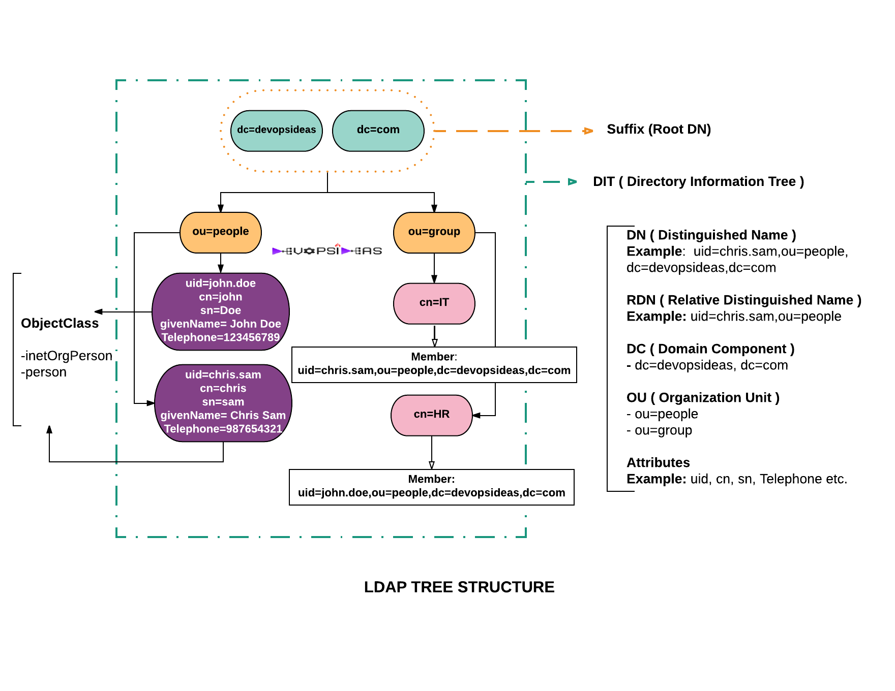

# LDAP

[basic concepts](https://ldap.com/basic-ldap-concepts/)
[french bs about ldab](http://www-sop.inria.fr/members/Laurent.Mirtain/ldap-livre.html).
openldap official site is a good starting too.

## Introduction
* ldap is an application layer protocol
* inspired from X.500 protocol.
* LDAP server holds records about systems, users, networks, resources, applications... It's a directory service.
* A common use is to store roles, usernames and passwords to allow many different applications to use the ldap server to validate users.



## Overview
* The client uses a directory user agent (DUA) to connect to the ldap server (called directory system agent DSA).
* by default, it uses the tcp or udp port 389, or 636 for ldaps (over tls).
* it's not a synchronous protocol, a client can send many request at a time.
* a client can send multiple operations:
    * StartTLS – use the LDAPv3 Transport Layer Security (TLS) extension for a secure connection
    * Bind – authenticate and specify LDAP protocol version
    * Search – search for and/or retrieve directory entries
    * Compare – test if a named entry contains a given attribute value
    * Add a new entry
    * Delete an entry
    * Modify an entry
    * Modify Distinguished Name (DN) – move or rename an entry
    * Abandon – abort a previous request
    * Extended Operation – generic operation used to define other operations
    * Unbind – close the connection (not the inverse of Bind)
## Directory structure
* The protocol provides an interface with directories:
    * An entry consists of a set of attributes.
    * An attribute has a name (an attribute type or attribute description) and one or more values. The attributes are defined in a schema (see below).
    * Each entry has a unique identifier: its Distinguished Name (DN). This consists of its Relative Distinguished Name (RDN), constructed from some attribute(s) in the entry, followed by the parent entry's DN. Think of the DN as the full file path and the RDN as its relative filename in its parent folder (e.g. if /foo/bar/myfile.txt were the DN, then myfile.txt would be the RDN).
* entry example
```ldap
dn: cn=John Doe,dc=example,dc=com
cn: John Doe
givenName: John
sn: Doe
telephoneNumber: +1 888 555 6789
telephoneNumber: +1 888 555 1232
mail: john@example.com
manager: cn=Barbara Doe,dc=example,dc=com
objectClass: inetOrgPerson
objectClass: organizationalPerson
objectClass: person
objectClass: top
```
* "dn" is the distinguished name of the entry; it's not considered as an attribute of the entry.
* "cn=John Doe" is the entry's RDN (Relative Distinguished Name) or common name. 
* "dc" is the dn of the parent, known as the domain componenet.
* a server may reference an entry existing in another server.

## Operations
* ADD
    * inserts new entry if not existing.
    * The entry to be added must not exist, and the immediate superior must exist.
    * 
### Example
```
La forme générale est :

    dn: <distinguished name 
    objectClass: <object class 
    objectClass: <object class 
    ... 
    <attribute type:<attribute value 
    <attribute type:<attribute value 
    ...

Un entrée de type personne se représente de la manière suivante :

    dn: cn= June Rossi, ou= accounting, o= Ace Industry, c= US
    objectClass: person
    objectClass: organizationalPerson
    objectClass: inetOrgPerson
    cn: June Rossi
    sn: Rossi
    givenName: June
    mail: rossi@aceindustry.com
    userPassword: {sha}KDIE3AL9DK
    uid: rossi
    telephoneNumber: 2616
    roomNumber: 220

Les commandes de modification ont la syntaxe suivante :

    dn: distinguished name
    changetype <identifier
    change operation identifier
    list of attributes...
    ...
    -
    change operation identifier
    list of attributes
    ...
    <identifier : 
           add (ajout d'une entrée), 
        delete (suppression), 
        modrdn (modification du RDN), 
        modify (modification : add, replace, delete d'un attribut)

Le caractère - spécifie le séparateur entre 2 instructions

Par exemple :

    Ajouter le numéro de téléphone et le nom du manager pour la personne Lisa Jangles :

     dn: cn= Lisa Jangles, ou= Sales, o= Ace Industry, c= US 
     changetype: modify 
     add: telephonenumber
     telephonenumber: (408) 555- 2468
     -
     add: manager
     manager: cn= Harry Cruise, ou= Manufacturing, o= Ace Industry, c= US

    Pour détruire l'entrée

    dn: cn= Lisa Jangles, ou= Sales, o= Ace Industry, c= US 
    changetype: delete
```

 Opération LDAP 	Description
| Search 	recherche dans l'annuaire d'objets à partir de critères
| Compare 	comparaison du contenu de deux objets
| Add 	ajout d'une entrée
| Modify 	modification du contenu d'une entrée
| Delete 	suppression d'un objet
| Rename (Modify DN) 	modification du DN d'une entrée
| Bind 	connexion au serveur
| Unbind 	deconnexion
| Abandon 	abandon d'une opération en cours
| Extended 	opérations étendues (v3)

 Tableau 5. paramètres d'une requête Paramètre 	Description
base object  	l'endroit de l'arbre où doit commencer la recherche
scope 	la profondeur de la recherche
derefAliases 	si on suit les liens ou pas
size limit 	nombre de réponses limite
time limit 	temps maxi alloué pour la recherche
attrOnly 	renvoie ou pas la valeur des attributs en plus de leur type
search filter 	le filtre de recherche
list of attributes 	la liste des attributs que l'on souhaite connaître
## More indepth 

### Directory Servers
A directory server (more technically referred to as a Directory Server Agent, a Directory System Agent, or a DSA) is a type of network database that stores information represented as trees of entries. This is different from a relational database, which uses tables comprised of rows and columns, so directory servers may be considered a type of NoSQL database (even though directory servers have been around a lot longer than the term NoSQL has).

While virtually all directory servers support LDAP, some servers offer support for additional protocols that can be used to interact with the data. Some of these protocols include X.500 (the original Directory Access Protocol, for which LDAP is a much more lightweight version), naming service protocols like DNS and NIS, HTTP-based protocols like DSML and SCIM, and proprietary protocols like Novell’s NDS. 

Entries

An LDAP entry is a collection of information about an entity. Each entry consists of three primary components: a distinguished name, a collection of attributes, and a collection of object classes. Each of these is described in more detail below


## Personal remarks
* the node level in the tree doen't have a fixed type
* entries are defined in a reverse tree path.
* directory structure is very flexible, 
* an entry creation is based on the schema referenced by the objectClass keyword.
* multiple objectClasses could be referenced, this allows a combining multiple schema in one entry.

# Practical notes
## adding db
* on the slapd.ldif you can define databases with their suffix and theire root dn.
* example, this will create the db testdb accessible with the user cn=admin,dc=testdb.
```ldif
# my custom db.
dn: olcDatabase=mdb,cn=config
objectClass: olcDatabaseConfig
objectClass: olcMdbConfig
olcDatabase: mdb
olcDbMaxSize: 1073741824
olcSuffix: dc=testdb
# olcSuffix: dc=my-domain,dc=com
olcRootDN: cn=admin,dc=testdb
# Cleartext passwords, especially for the rootdn, should
# be avoided.  See slappasswd(8) and slapd-config(5) for details.
# Use of strong authentication encouraged.
olcRootPW: secret
# The database directory MUST exist prior to running slapd AND 
# should only be accessible by the slapd and slap tools.
# Mode 700 recommended.
olcDbDirectory:	/usr/local/var/openldap-data
# Indices to maintain
olcDbIndex: objectClass eq
```